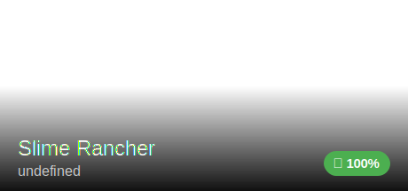
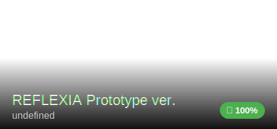

<picture>
  <source media="(prefers-color-scheme: dark)" srcset="https://readme-typing-svg.herokuapp.com?font=VT323&size=20&duration=3000&pause=300&color=cfcfcf&center=true&vCenter=true&multiline=true&repeat=false&width=700&height=100&lines=Welcome!;I'm+Camila%2C+a+19+y+old+programming+enthusiast;I+write+code+:)">
  <source media="(prefers-color-scheme: light)" srcset="https://readme-typing-svg.herokuapp.com?font=VT323&size=20&duration=3000&pause=300&color=000000&center=true&vCenter=true&multiline=true&repeat=false&width=700&height=100&lines=Welcome!;I'm+Camila%2C+a+19+y+old+programming+enthusiast;I+write+code+:)">
  
</picture>

> please give a look on my last projects: \
[zig library for building disk images](https://github.com/lumi2021/image-builder) \
[tq language compiler](https://github.com/tqlang/tq-compiler)

## Randomness About Me

- 🔭 Currently working on a [compiler](https://github.com/tqlang/tq-compiler) and an [operating system](https://github.com/Anthragon/Distribution)
- 🌱 Breathing
- 📫 Talk with me in my Discord DM ([@lumi_nya](https://discordapp.com/users/632992487375634432))
- 😄 Pronouns: She / Her


 \


 \


 \


 \


<!--  -->

## My Activity

<!-- START_SECTION: github.activity -->
- 🎉 Merged pull request [#17](https://github.com/taijarals/lobo_ovelha_cacador/pull/17) in [taijarals/lobo_ovelha_cacador](https://github.com/taijarals/lobo_ovelha_cacador)
- 🎉 Merged pull request [#16](https://github.com/taijarals/lobo_ovelha_cacador/pull/16) in [taijarals/lobo_ovelha_cacador](https://github.com/taijarals/lobo_ovelha_cacador)
- ‼️ Opened pull request [#92](https://github.com/tgies/klattsch/issues/92) in [tgies/klattsch](https://github.com/tgies/klattsch)
- ✏️ Made 5 commits
- 🎉 Merged pull request [#15](https://github.com/taijarals/lobo_ovelha_cacador/pull/15) in [taijarals/lobo_ovelha_cacador](https://github.com/taijarals/lobo_ovelha_cacador)
- ↗️ Openned pull request [#120611](https://github.com/godotengine/godot/pull/120611) in [godotengine/godot](https://github.com/godotengine/godot)
- ✏️ Made 6 commits
- ❌ Closed pull request [#9](https://github.com/taijarals/lobo_ovelha_cacador/pull/9) in [taijarals/lobo_ovelha_cacador](https://github.com/taijarals/lobo_ovelha_cacador)
- ✏️ Made 2 commits
- ✏️ Made 2 commits
<!--END_SECTION-->

<!-- START_SECTION: wakatime.weekly_langs -->
```rust
Total Time: 21 hrs 19 mins

- "C#"            ⣿⣿⣿⣿⣿⣿⣿⣿⣿⣿⣿⣿⣦⣀⣀⣀⣀⣀⣀⣀ 13 hrs 21 mins
- "Zig"           ⣿⣿⣿⣿⣤⣀⣀⣀⣀⣀⣀⣀⣀⣀⣀⣀⣀⣀⣀⣀ 4 hrs 36 mins
- "JavaScript"    ⣿⣷⣀⣀⣀⣀⣀⣀⣀⣀⣀⣀⣀⣀⣀⣀⣀⣀⣀⣀ 1 hr 57 mins
- "IL"            ⣤⣀⣀⣀⣀⣀⣀⣀⣀⣀⣀⣀⣀⣀⣀⣀⣀⣀⣀⣀ 23 mins
- "Text"          ⣤⣀⣀⣀⣀⣀⣀⣀⣀⣀⣀⣀⣀⣀⣀⣀⣀⣀⣀⣀ 16 mins
```
<!--END_SECTION-->

<!-- START_SECTION: github.most_starred -->
<!--END_SECTION-->

Support my work, buy me a coffee! (pls coffee is really expensive in brazil lol) \
[](https://ko-fi.com/R5R413JQF9)


<!-- ## Musics I like -->
<!-- START_SECTION: last_fm -->
  <!--TEMPLATE {
    id: '#',
    track_cover: 'Cover',
    track_link: 'Track',
    track_artist_link: 'Artist',
    track_duration: 'Duration',
    times_listened: 'Times Listened',
  } -->
<!--END_SECTION-->
[](https://spotify-github-profile.kittinanx.com/api/view?uid=ud98hywtrhb6tsypqvhg9rc5g&redirect=true)


## Socials

### Steam
<!-- START_SECTION: steam.profile -->
[mew_mila (Camila) - Online](https://steamcommunity.com/profiles/76561198434273671/)
<!--END_SECTION-->

### Recent games
<!-- START_SECTION: steam.recent_games -->
| Icon | Name | Time played | Achievements |
|:----:|:----:|:-----------:|:------------:|
|  | Cookie Clicker | 88h 8m | 551 / 637 (86% |
|  | Plague Inc: Evolved | 11h 39m | 48 / 250 (19% |
|  | Besiege | 8h 21m | 8 / 54 (15% |
|  | The Binding of Isaac: Rebirth | 2h 39m | 9 / 641 (1% |
|  | BOMBANANA! Demo | 2h 30m | n/a |
<!--END_SECTION-->

### Perfected games
<!-- START_SECTION: steam.perfected_games -->
### Asset Review for Viscera Cleanup Detail: Shadow Warrior
<p><strong>Header:</strong></p>

<p><strong>Capsule:</strong></p>

<p><strong>Hero:</strong></p>

<p><strong>Cover (Vertical):</strong></p>

<p><strong>Logo:</strong></p>


### Asset Review for Slime Rancher
<p><strong>Header:</strong></p>

<p><strong>Capsule:</strong></p>

<p><strong>Hero:</strong></p>

<p><strong>Cover (Vertical):</strong></p>

<p><strong>Logo:</strong></p>



### Asset Review for REFLEXIA Prototype ver.
<p><strong>Header:</strong></p>

<p><strong>Capsule:</strong></p>

<p><strong>Hero:</strong></p>

<p><strong>Cover (Vertical):</strong></p>

<p><strong>Logo:</strong></p>



### Asset Review for Kota`s New Journey
<p><strong>Header:</strong></p>

<p><strong>Capsule:</strong></p>

<p><strong>Hero:</strong></p>

<p><strong>Cover (Vertical):</strong></p>

<p><strong>Logo:</strong></p>


<p align='center'><sub><i>Disclaimer: All game titles, arts, logos, and trademarks belong to Steam (Valve Corporation) and their respective developers.</i></sub></p>
<!--END_SECTION-->


### Others
[](https://discordapp.com/users/632992487375634432)
[](https://www.linkedin.com/in/leoaraujodev)
[](https://www.threads.com/@42batata42)

> Thanks for read :p